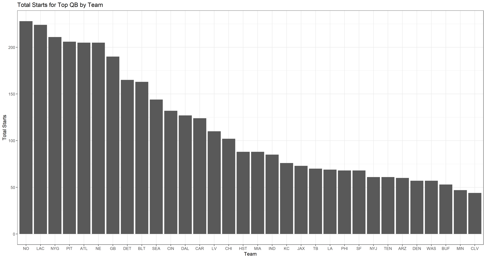
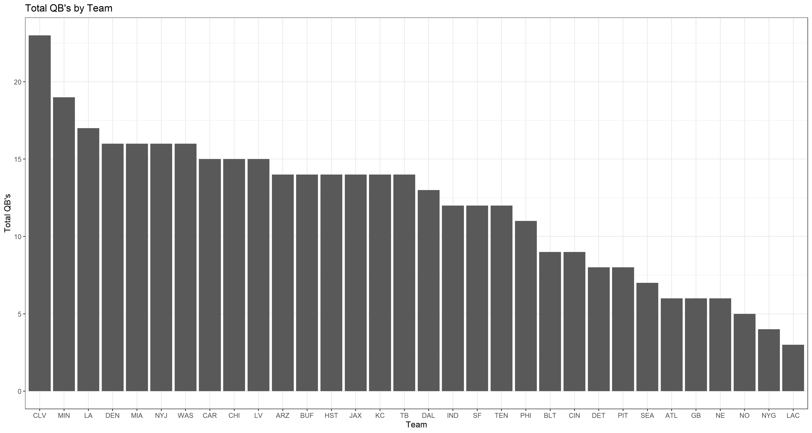

## Project Purpose

Sports analysis is tough.  Without experience in data scraping, it's quite difficult to find data sets that have comprehensive numbers for multiple years.

Luckily, there is a [Workout Wednesday](http://www.workout-wednesday.com/2021-week-34-how-many-consecutive-starts/) challenge that asks users to plot consecutive quarterback starts for NFL teams since 2006.  Although I'm not interested in _consecutive_ starts, I am interested in quarterback numbers and team efficiency!

That's where [Statmuse](https://www.statmuse.com/nfl/ask/tom-brady-career-qbr) comes into play.  For relatively basic stats, you can ask their website a question, and it will pop out multiple statistics related to it!  Now, the more specific question, the tougher time Statmuse has to comprehend, BUT with something like QBR, all I have to do is ask the same question for 32 quarterbacks.  Now for some interesting plots.

With this first plot, we are looking at the total starts for the "most-start" QB for each team.  So, if you're familiar with the NFL, you can probably name the first 12 or so teams without a thought.  Brees, Rivers, Manning, Roethlisberger, etc.  When you get to the 15-20 range, that's where it gets tough.  These teams, especially Cleveland, have never been able to find a consistent quarterback to last more than 3 or 4 years.

Here is a similar plot, showing total number of different quarterbacks for each team.  So you'll see the _fantastic_ Cleveland Browns on the first plot having the least starts, and on the second plot having the MOST quarterbacks.  Makes sense.  Now, if you're not familiar with football, you might wonder if this even matters in the long run?  If a team play more quarterbacks, do they inherently have worse offense?

Well yes, yes they do.  There seems to be a clear correlation with number of quarterbacks played and number of total touchdowns by a team's offense.  Considering touchdowns are the primary point-producing play, this is pretty clear and cut. _That being said_, they have worse offense, but do they win less?  Maybe their defense can hold the fort and win with the worse offense!

Well, it seems that the [worse a team's top qb plays](https://en.wikipedia.org/wiki/Passer_rating), the worse their team's win/loss is.  Although it might seem more evenly spread, there is a noticeable jump in win/loss once a quarterback has above around 95 [QBR](https://en.wikipedia.org/wiki/Passer_rating).

##Additional Conclusions

In general, as expected, it is clear that a team with a reliable, starting quarterback performs better than one without.  This can be seen in win/loss, total offensive output(touchdowns), and most likely other aspects like playoff/Super Bowl appearances if the data was provided or added.

